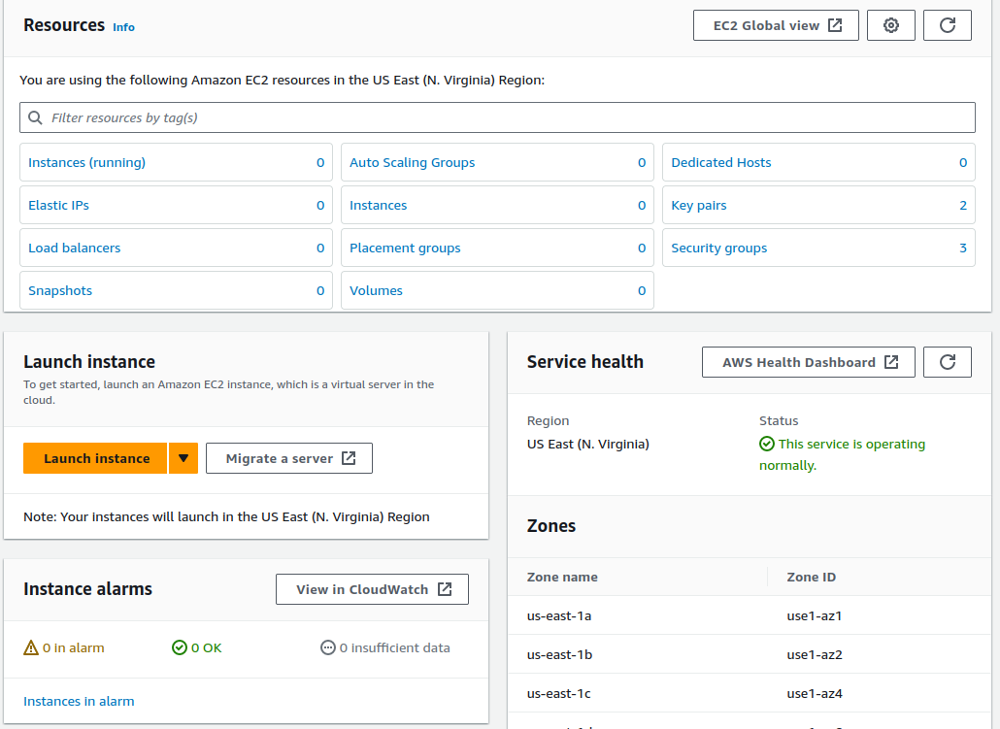
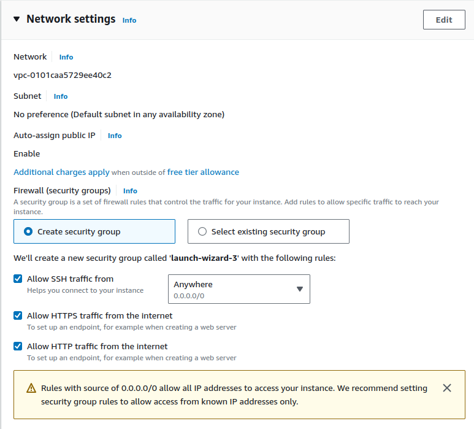

# Deploying a Decidim Instance

## Create an AWS EC2 Instance
First, create an AWS account and go to the AWS Management Console. \
Then, go to the EC2 Panel and select the big orange button `Launch Instance`. 



Then, select your instance name, operating system (for this tutorial we will be using Amazon Linux x86), instance type (we will be using t2.medium, with 2 vCPUs and 4GB RAM it's enough), and generate a key pair for connecting to it through ssh. \ 

Next, set up the firewall rules as you please, but since this is meant to be a web server, you should leave it like this:



Finally, set the amount of storage you will need for this server. In this case, you should at least give it 50GB of storage. Click on launch instance and you are set to go.

## Connect to your AWS EC2 instance
Using the keypair you have created previously, execute the following command to ssh into the machine:
```bash
ssh -i keypair.pem ec2-user@yourinstanceip
```

## Generating selfsigned certificates
If you haven't bought a domain, you can still use the application through self-signed SSL certificates, but browsers will raise a warning.
```bash
sudo openssl req -x509 -nodes -days 365 -newkey rsa:2048 -keyout ./selfsigned.key -out ./selfsigned.crt
```
This command should generate your self-signed certificate and private key and move it to the decidim-tutorial directory. \
Then, open nginx.conf and add under `listen 443 ssl;` the following lines:
- `ssl_certificate /etc/ssl/certs/selfsigned.crt;`
- `ssl_certificate_key /etc/ssl/certs/selfsigned.key;` \
Then, open nginx.Dockerfile and modify it so that the copy commands look like this:
- `COPY nginx.conf /tmp/docker.nginx`
- `COPY selfsigned.crt /etc/ssl/certs/selfsigned.crt`
- `COPY selfsigned.key /etc/ssl/certs/selfsigned.key`

## Generating a certificate for your specific domain using Let's Encrypt
```bash
sudo certbot certonly --standalone -d subdomain.domain.tld -v
cp /etc/letsencrypt/live/subdomain.domain.com/fullchain.pem .
cp /etc/letsencrypt/live/subdomain.domain.com/privkey.pem .
```
These commands should generate your certificate and private key and move it to the decidim-tutorial directory. \
Then, open nginx.conf and add under `listen 443 ssl;` the following lines:
- `ssl_certificate /etc/ssl/certs/fullchain.pem;`
- `ssl_certificate_key /etc/ssl/certs/privkey.pem;` \
Then, open nginx.Dockerfile and modify it so that the copy commands look like this:
- `COPY nginx.conf /tmp/docker.nginx`
- `COPY fullchain.pem /etc/ssl/certs/fullchain.pem`
- `COPY privkey.pem /etc/ssl/certs/privkey.pem`

## Creating a Docker Swarm cluster and deployng decidim stack
These commands will create a docker swarm cluster to orchestrate and manage the services needed to run decidim and its services.
```bash
sudo docker swarm init
```
Update your SMTP server's environment variables in `docker-compose.yml` and then execute the following commands:
```bash
sudo docker-compose build
sudo docker stack deploy --detach=false -c docker-compose.yml decidim-tutorial
```

## Creating a System Admin User
To create a System Admin User, you only need to execute a single script and pass it its credentials:
```bash
cd scripts
sudo docker ps # This will show every container with its id, name, image_name, etc
./create-sysadmin.sh <DECIDIM_CONTAINER_ID> <EMAIL> <PASSWORD>
```

## Creating a New Organization

Visit `https://localhost:443` or `subdomain.domain.tld`, and log in with the system user you have created. Fill the form with your organization's data and set `localhost` or `subdomain.domain.tld` as the host.

### SMTP Server config and Organization Admin Creation

In Decidim 0.28.0 there is a bug that will not allow to set your smtp server from the system panel, as if you introduce a password, it will crash and not create a new organization. Leave those fields empty, as you should have already configured your SMTP server in `docker-compose.yml`.

Fill the Organization Admin fields with its name and its email. Decidim will send an email to the provided address. Follow the steps to create an admin account.

## Customize Your Organization

Navigate to `https://localhost:443/` or `subdomain.domain.tld` and log in as the user you just updated.
Customize the website to your preferences!

## Set Up a Cron Job to backup Decidim's database
First, edit the paths inside `cron-backup-pg.sh` to match yours.
```bash
sudo dnf install cronie
chmod +x cron-backup-pg.sh
sudo crontab -e
0 0 */7 * * /home/ec2-user/decidim-tutorial/scripts/cron-backup-pg.sh # Paste this inside the text editor and exit
```
These commands will automatically run the backup script once every 7 days.
